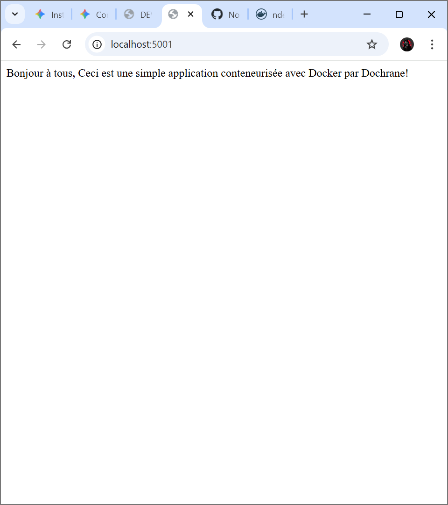

# TP A1 : Docker (Dockerfile, Image et Conteneur)

**Nom :** Dochrane
**Objectif :** Déploiement d'une application Flask conteneurisée.

## 1. Lien de l'image sur Docker Hub
[Image sur Docker Hub](https://hub.docker.com/r/ndessop/dochrane-flask-app)

## 2. Accès à l'application
L'application est configurée pour répondre sur le port **5001** de l'hôte.

## 3. Preuve de fonctionnement

